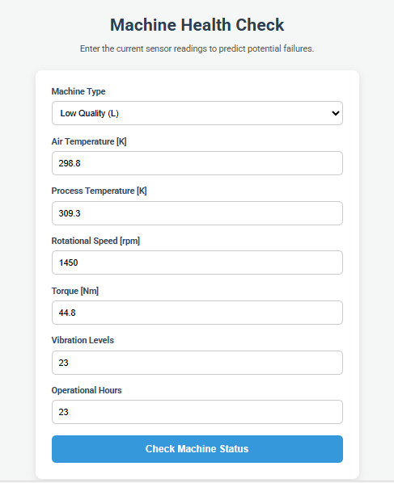
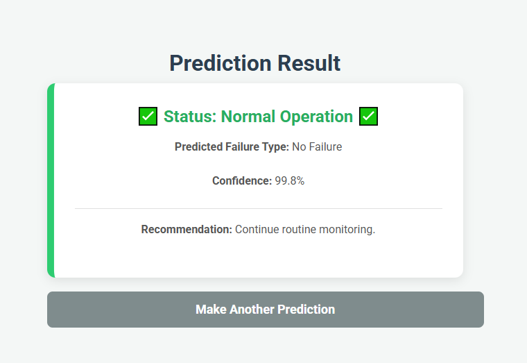
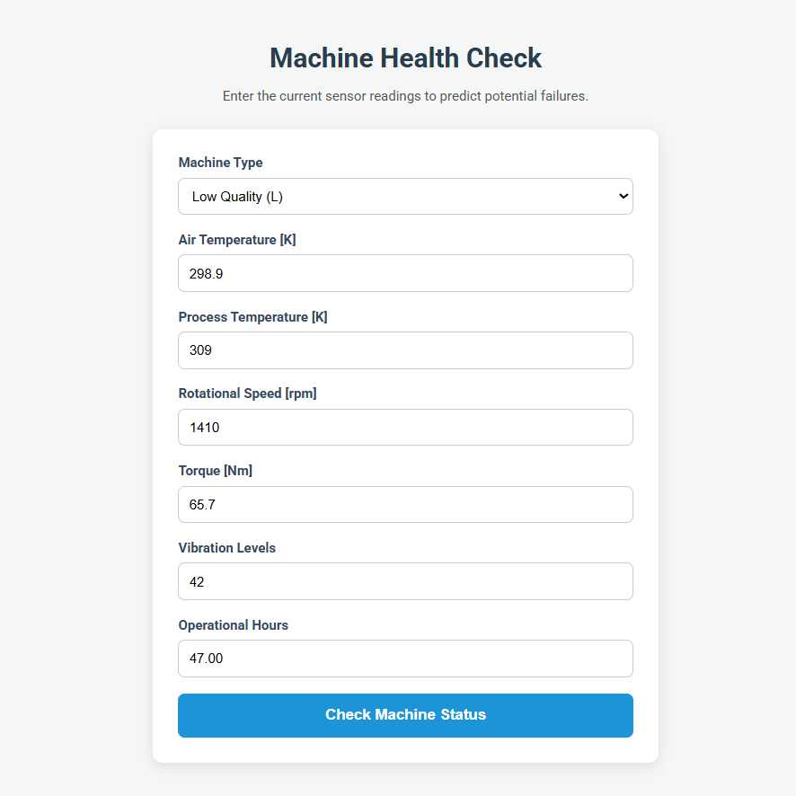
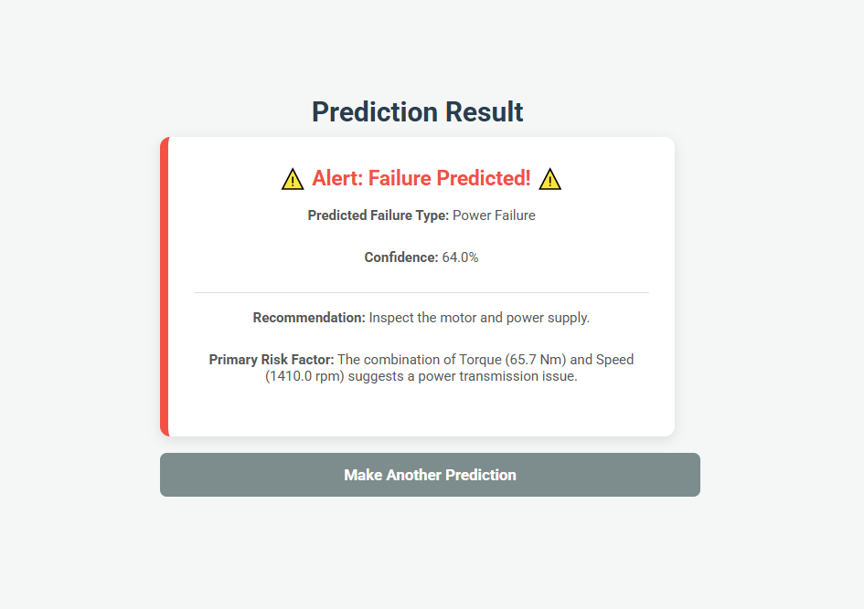

# Predictive Maintenance ML Web App ⚙️


A user-friendly web application that leverages a machine learning model to predict potential equipment failures based on operational data. This tool helps prevent costly downtime by providing early warnings about machine health.

*This project is a perfect demonstration of deploying a data science model into a practical, interactive application.*

## 🌟 Why This Project is Important

In manufacturing and industrial settings, unexpected machine failures can halt production, leading to significant financial losses. This project demonstrates a practical solution by applying data science to a real-world business problem. It's not just about predicting a failure; it's about providing a **clear, understandable, and actionable insight** that can save a company time and money.

## 📸 App Demo & Walkthrough

Here’s a quick walkthrough of the application, from entering data to receiving a prediction.

**1. Main Interface:** The user enters the operational data for the machine into a clean, simple web form.



**2. Prediction: No Failure:** If the parameters are within the normal operating range, the model predicts "No Failure" with high confidence.



**3. Adding Information about Another Machine:** Here, we are adding data of a different machine to check its status.



**4. Prediction: Power Failure + Actionable Recommendations:** 
When the data indicates a potential issue (e.g., high torque and low rotational speed), the model predicts the specific failure type. Here, it predicts an "Power Failure."
Alongside the prediction, the app provides a clear confidence score and a practical recommendation for the maintenance team.



## ✨ Key Features

*   **Intuitive Web Interface:** A clean and simple form built with Flask and HTML/CSS for easy data entry.
*   **Intelligent Predictions:** Utilizes a trained **Random Forest** model to predict different failure types, plus a "No Failure" state.
*   **Imbalance-Aware Training:** The model is trained using class weighting to handle the highly imbalanced nature of real-world failure data.
*   **Robust Backend:** The Flask app is well-structured, handles user input, and follows best practices for loading a pre-trained `joblib` model pipeline.

## 🛠️ Tech Stack

*   **Backend:** Python, Flask
*   **Machine Learning:** Scikit-learn, Pandas, NumPy, imbalanced-learn, Joblib
*   **Data Analysis:** Jupyter Notebook, Matplotlib, Seaborn
*   **Environment:** Virtualenv for dependency management

## 📂 Project Structure

The project is organized following standard Flask conventions for scalability and maintainability.

```
predictive-maintenance-machine-learning-flask-app-main/
├── app.py                      
├── config.ini                  
├── requirements.txt            
├── README.md                   
├── assets/                     # Screenshots of app
├── dataset/                    
│   └── CIA-1 Dataset - Dataset.csv
├── notebook/
│   └── weather-prediction-ml.ipynb 
├── saved_models/
│   └── electrical_failure_model.joblib 
├── static/
│   └── css/                    
└── templates/
    ├── index.html              
    └── result.html             
```

## 🚀 How to Run This Project Locally

Follow these simple steps to get the application running on your machine.

### 1. Prerequisites

*   Python 3.8 or newer
*   `pip` and `virtualenv`

### 2. Clone the Repository

```bash
git clone https://github.com/MdEhsanulHaqueKanan/predictive-maintenance-machine-learning-flask-app.git
cd predictive-maintenance-machine-learning-flask-app-main
```

### 3. Set Up a Virtual Environment

It's a best practice to create a virtual environment to keep project dependencies isolated.

#### Option A: Using `venv` (Standard Python)

**On macOS/Linux:**
```bash
python3 -m venv venv
source venv/bin/activate
```

**On Windows:**
```bash
python -m venv venv
.\venv\Scripts\activate
```

####  Option B: Using Anaconda/Conda
Create a new conda environment named 'predictive-maintenance' with Python 3.10:
```
conda create --name predictive-maintenance python=3.10 -y
```

Activate the environment:
```
conda activate predictive-maintenance
```


### 4. Install Dependencies

Install all the required Python libraries using the `requirements.txt` file.

```bash
pip install -r requirements.txt
```

### 5. Getting the Pre-Trained Model

The trained model is not stored in this repository. To run the web application, please download the pre-trained model file first.

1.  **Download the model:** [Click here to download `electrical_failure_model.joblib`](https://drive.google.com/file/d/1iP9UGO0zD8adzWJO2YGsk_Dc6wwvCzRl/view?usp=sharing)
2.  **Place the file:** Create a folder named `saved_models` in the root of the project and place the downloaded `electrical_failure_model.joblib` file inside it.

The project structure should look like this:
```
predictive-maintenance-machine-learning-flask-app-main/
├── app.py
├── saved_models/
│ └── electrical_failure_model.joblib <-- Place the file here
└── ...
```

### 6. Run the Application

Start the Flask development server.

```bash
python app.py
```

You should see output indicating the server is running, typically on `http://127.0.0.1:5000`. Open this URL in your web browser to use the app!

## 📈 The Machine Learning Workflow

1.  **Data Input:** A user enters sensor readings (like temperature, torque, etc.) into the web form.
2.  **Feature Engineering:** The Flask backend receives the data and creates two new, critical features:
    *   `Temp_diff_K`: The difference between process and air temperature.
    *   `Power_W`: The calculated power output, a combination of torque and rotational speed.
3.  **Prediction:** The complete set of features is fed into the pre-trained `electrical_failure_model.joblib` pipeline. This pipeline automatically handles data scaling and makes a prediction.
4.  **Display Results:** The application displays the predicted failure type, the model's confidence in that prediction, and a helpful recommendation for the maintenance team.

---

## 📈 Results and Model Performance

The project successfully developed and evaluated several machine learning models. The **Random Forest** model was chosen for deployment due to its superior performance on our highly imbalanced dataset, as measured by the **Macro F1-Score**.

### Model Performance Comparison

| Model                 | Macro F1-Score |
| :-------------------- | :------------- |
| **Random Forest**     | **0.41**       |
| **Gradient Boosting** | 0.27           |
| **Decision Tree**     | 0.20           |
| **Logistic Regression**| 0.07           |

### Best Model In-Depth: Random Forest

*   **Overall Accuracy:** **93.0%**
*   **Macro F1-Score:** **0.41**

The high accuracy is primarily driven by the model's ability to correctly identify the majority "No Failure" class. The Macro F1-Score provides a more balanced view of its performance across all failure types.

**Classification Report:**
The report shows that the model is excellent at predicting "No Failure" and "Overstrain Failure" but is challenged by the rarer failure types due to limited data.

| Failure Category      | Precision | Recall | F1-Score |
| :-------------------- | :-------- | :----- | :------- |
| **No Failure**        | 0.96      | 0.98   | 0.97     |
| **Overstrain Failure**| 0.50      | 1.00   | 0.67     |
| **Power Failure**     | 0.00      | 0.00   | 0.00     |
| **Tool Wear Failure** | 0.00      | 0.00   | 0.00     |

### Key Finding: Feature Importance

The Random Forest model identified **`Operational Hours`** as the most significant feature for predicting machine failure.

## 🏁 Conclusion and Future Work

The final Random Forest model serves as a strong baseline for this predictive maintenance task. The main challenge remains the severe class imbalance, which limits the model's ability to generalize for rare failure events.

Future work could focus on:

*   **Data Augmentation:** Collecting more data for underrepresented failure types.
*   **Advanced Sampling:** Experimenting with techniques beyond SMOTE, such as ADASYN.
*   **Anomaly Detection:** Framing the problem as an anomaly detection task rather than multi-class classification.

---

Developed by Md. Ehsanul Haque Kanan